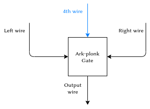
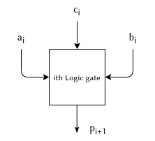

# PLONK library


PLONK is a generic Rust PLONK implementation using arkworks as a backend. This PLONK library is one of many projects implementing PLONK like: 
TurboPlonk, UltraPlonk, Plonky, ShPlonk, PLOOKUP, PLONKUP, halo2 etc.

PLONK is however the only generic implementation which allows any curve implementation or commitment scheme to be used and unlike other libraries is not restricted to only one implementation.


## State of the art

The AZTEC team developed PLONK in 2020. It uses the KZG's pairing-based polynomial commitment scheme and this allows it to be universal, i.e., the same KZG commitment setup parameters an be used for zkSNARK proofs of circuits up to a certain size. 
Since then, PLONK has become very popular and lots of projects like Matter Labs, Zcash's Halo 2, Mina, Mir and others started using it and developed their own variations. 

Both Mir and Zcash use PLONK combined with [Halo’s polynomial commitment scheme](https://eprint.iacr.org/2019/1021.pdf) for their libraries [Plonky](https://github.com/mir-protocol/plonky) and [Halo2](https://github.com/zcash/halo2). Halo based schemes do recursive proofs without pairings using elliptic curves that are not pairing friendly and can run without the need for trusted setups. In a recursive proof, the verifier is coded inside the circuit which allows us to verify a proof provided as part of the witness inside of another proof. In this way the verifier effectively checks many proofs, even though it only verifies the outermost proof.

In a KZG system, the proof size is very small (less than a kilobyte), constant in the size of the circuit and the witness, and also the verification time is constant. This makes it easier to verify on Ethereum but recursion is harder to do with pairings. 
Halo based schemes have decent proof size and prover time, but take linear time to verify and they can currently not be verified on Ethereum.

Mir recently developed an optimized proving system [Plonky2](https://github.com/mir-protocol/plonky2) based on PLONK and FRI polynomial commitments. 
A FRI-based ZK-STARKs algorithm provides both quantum-resistance and does not require any trusted setups while the KZG scheme uses elliptic curve pairing which is not quantum resistant and requires a third-party trusted setup. FRI has a blowup factor which measures how much redundancy a polynomial needs to add before the commitment is generated and thus makes the prover faster. 
Plonky2 claims a 100x speed up for ethereum for $170ms$ comparing to Plonky which takes $15s$ for proving times. 
This PLONK repo is an optimization of the original PLONK protocol and guarantees $3.44s$ for proving time and $4.50ms$ for verifier speed comparing to $60$ proof times in the original PLONK design.

A differentiating factor of this PLONK library is that it uses Arkworks generic backend, a rust library that abstracts over mathematical curves and fields and allows to program algorithm in a generic field agnostic way. This implementations is therefore valid for any curve implementation, e.g., for various pairing curves and edwards twisted curves.  
Our PLONK implementation also uses a generic polynomial commitment scheme based on [ark-poly-commit](https://docs.rs/ark-poly-commit/0.3.0/ark_poly_commit/) which provides various constructions of polynomial commitment schemes. As a result, the library can potentially leverage other commitment schemes like quantum resistent FRI and is not restricted only to KZG10.

There is currently no other library that allows for the freedom of generic parameters. Zcash's Halo2 and Plonky use the HALO commitment scheme while plonky2 uses only FRI scheme. In terms of elliptic curves, the Aztecs implementation of PLONK is based on BN256.

## Circuit implementation

This implementation is an optimization of the original PLONK protocol and adds the support of lookup table to PLONK circuit. This optimization allows for precomputation of some of the operations that are not snark friendly such as bit operations (see [PLOOKUP](https://eprint.iacr.org/2020/315.pdf) for further explanation on PLONK + LOOKUP tables).

Our implementation also supports custom gates similarly to [TurboPlonk](https://docs.zkproof.org/pages/standards/accepted-workshop3/proposal-turbo_plonk.pdf). This allow us to define our own custom bit arithmetic operations, e.g., to support efficient Poseidon or MIMC hashes that can be efficiently evaluate inside the SNARK circuit. 

### Custom gates

The original Plonk protocol supported circuits whose gates perform basic arithmetic operations: additions and multiplications. Plonk  extends the arithmetic "gate" and allows for the creation of new customized gates which can perform many different operations such as EC additions, logical XOR, efficient Poseidon or Pedersen hashes.

The different types of gates currently supported by this implementation are:

* [Arithmetic gate](https://github.com/ZK-Garage/plonk/blob/master/plonk-core/src/constraint_system/arithmetic.rs) (similar to Plonk)
* [Logic gate](https://github.com/ZK-Garage/plonk/blob/master/plonk-core/src/constraint_system/logic.rs): Provide bitwise AND and XOR operations.
* [Range gate](https://github.com/ZK-Garage/plonk/blob/master/plonk-core/src/constraint_system/range.rs).
* EC operations:
   - Curve addition ([Fixed base](https://github.com/ZK-Garage/plonk/blob/master/plonk-core/src/constraint_system/ecc/curve_addition/fixed_base_gate.rs) and [variable base](https://github.com/ZK-Garage/plonk/plonk-core/blob/master/src/constraint_system/ecc/curve_addition/variable_base_gate.rs))
   - Scalar multiplication ([Fixed base](https://github.com/ZK-Garage/plonk/blob/master/plonk-core/src/constraint_system/ecc/scalar_mul/fixed_base.rs) and [variable base](https://github.com/ZK-Garage/plonk/blob/master/plonk-core/src/constraint_system/ecc/scalar_mul/variable_base.rs))


Selector polynomials (SP) activate or deactivate a specific gate depending on the value of gate output selector polynomial. We use the following notation:

* $q_{arith}$ : arithmetic gate selector polynomial
* $q_{logic}$ : logic gate SP
* $q_{range}$ : range gate SP
* $q_{ECfix}$: fixed group addition gate SP
* $q_{ECvar}$:  variable group addition SP


The gate constraint equation is represented as follow:

$$
q_{arith} \cdot \textit{arith\_eq} + q_{logic} \cdot  \textit{logic\_eq} + q_{range} \cdot  \textit{range\_eq} +
q_{ECfix} \cdot  \textit{ECfix\_eq} +
q_{ECvar} \cdot  \textit{ECvar\_eq}
=0
$$


In order to use one of these gates, we set the value of its associated SP to $1$ and the others to $0$. Let's say for example we want to use the range gate, we set $$q_{range}:=1$$ and   $$q_{arith}=q_{logic}= q_{ECfix}= q_{ECvar}:=0$$


#### Design custom gates
Before we explain how each of the previous mentioned custom gates are designed, we need to talk about fan-in 3 gates and why we use them at ark-plonk instead of fan-in 2 gates?
The original Plonk design uses fan-in 2 gates which means each gates has two inputs and one output wires.
These new PLONK gates, on the other hand, are fan-in-3 gates, so they have one more wire making it 4 wires in total.
The following figure depicts a fan-in 3 gate:

<p align="center">
  
  
</p>
 
The arithmetic constraint equation of the original PLONK paper is

$$
q_m \cdot a \cdot b + 
q_l \cdot a +
q_r \cdot b +
q_o \cdot c +
q_c +
PI
= 0
$$

where $a$ is the left wire, $b$ is the right wire, $c$ is the output wire and $q_l, q_r, q_o, q_m, q_c$ are the associated selector polynomials. After the addition of a fourth wire $d$ the equation becomes:
$$
q_m \cdot a \cdot b + 
q_l \cdot a +
q_r \cdot b +
\color{#007FFF}{q_d \cdot d} +
q_o \cdot c +
q_c +
PI
= 0.
$$

This repository still allows the use of fan-in 2 gates only by setting the 4th wire selector, $q_d$, to $0$. 
The advantage of this design is that it make an additonal witness element available and thus allows to reduce the gate counts.
Its disadvantage is a negative impact on both the proof size and the verifier's execution time. It increases the permutation polynomial degree (to support 4 instead of 3 identity permutations) which leads to an n−degree increase in the quotient polynomial (from $3n$ to $4n$)
and to an increase in the FFT degrees. The proof size increases by one additional commitment to the wire polynomial and one additional group element. The verification time will also increase (21 exponentiations in $G_1$ instead of $18$ for classic Plonk):
* 7 from the linearization polynomial opening, 
* 11 from the quotient polynomial opening
* 1 from the evaluation commitment 
* 1 from the polynomial commitment argument for evaluation at $z$  
* 1 from the polynomial commitment argument for evaluation at $zw$ 

**Range gate**

A range-constraint gate checks if a variable $v$ is inside a range $[0,2^{n}-1]$ where $n$ is the bit size of the range. For instance, if we want to guarantee that $v$ is in the range $[0,1023]$, then $n=10$).

For technical reasons, the number of bits needs to be divisible by 2 ( $n$ % $2 == 0$)
       
Each gate contains 4 accumulated quads (base-4 digits)
which means $n_{quads}=n_{gates}*4$ where $n_{gates}$ is number of gates and $n_{quads}$ is number of quads.

We have two cases:

* $n$ is divisible by 8:
 We find out how many gates are needed by doing $n_{gates}=n$ % $8$. We add a zero accumulator genesis gate (with $a_0=0, b_0=0,c_0=0 \; and\; p_0=0$) which is used to prove that the first digit is indeed a quad. 

 * $n$ is not divisible by 8:

   In our previous example range $[0,2^{10}-1 ]$, when dividing 10 by 8, we get 1 as the number of gates, when in fact we need 2 gates.
        
   In this case we increase number of gates by one:
   ```
   if n % 8 != 0 {
            num_gates += 1;
        }
   ```

The last gate must only contain one quad in the fourth wire. This is needed in order for the range gate equation not to be used on the last gate (since it only looks at the fourth for the next gate).

As a conclusion: we will always use 1 more gate than the number of gates calculated Either due to the genesis quad, or the padding used to ensure we have 1 quad on the last gate 

```used_gates = num_gates + 1;```

Example: lets take $n=34$ which requires 17 quads (since each quad has 2 bits). We add one for the
zeroed out accumulator so 18 quads in total. We compute number of gates as ($n_{gates}=n_{quads} \div 4= 4$). We can fit all of these quads in 5 gates ($n$ % $8!= 0$ which means $n_{gates}=4+1=5$). 

 We check how many quads are in each gate by doing  $18$ % $4 = 2$ so on the last row, we will have two quads. Since each gate has 4 quads and the last gate must only contain one so we must pad the beginning in order to get one quad on the last row: 
$18+X$ % $4 = 1$ where $X=3$ represents the extra zeroes.
We now have 21 quads and $21 \div 4 = 5$ remainder 1, so we will need 5 full gates and extra gate with 1 quad.
       
### Logic gates

The plonk logic gates can perform bitwise AND and XOR operations. 
Each gate adds $k = n \div 2 + 1$ constraints to the circuit where $n$ % $2==0$ ($n$ is number of bits).


<p align="center">
  
  
</p>


 - The **left wire** $a_i$ contains the left accumulated quad:
$$
a_0 = 0\\
a_i = a_{i-1} \cdot 4 + a_i \text{, for } 1 \leq i \leq k
$$

 - The **right wire** $b_i$ contains the right accumulated quad:
$$
b_0 = 0\\
b_i = b_{i-1} \cdot 4 + b_i \text{, for } 1 \leq i \leq k
$$

 - The **fourth wire** $c_i$ is actually the result of the selected logic operation between the last (__not accumulated__) quad 

 - The **output wire** is connected to the product of the quads of the previous gate:
$$
p_i = a_i \cdot b_i \text{, for } 1 \leq i \leq k
$$

The result of the operation ends up in the 4th wire of the last subgate. 

We will have  $n_{quads}=n\div 2$ (every quad contains 2 bits).
We use a boolean selector `is_xor_gate` to choose whether the gate performs XOR or and AND operation:
- `is_xor_gate = 1` means it performs XOR between the first $n$ for $a$ and $b$.
- `is_xor_gate = 0` means it performs AND between the first $n$ for $a$ and $b$.

#### Logic gates full scheme


<p align="center">
  
  
</p>

On each round, we get the ith quads of $a$ and $b$ and then
compute `out_quad` of $c_i$ logical OP result `&` or `^`) and `prod_quad` of $p_i$ (intermediate prod result).
The result of the operation ends up in the 4th wire of the last subgate. 


### Lookup tables
The concept of lookup tables is to use precomputed tables in Plonk which allows circuits to be encoded more efficiently. These tables contain the most commonly used computation units which are very expensive to compute each time like XOR or AND operation between bit strings, or common hash functions such as AES-128 or SHA-256...etc. This removes the aspect of circuit complexity needed to compute the function, so the complexity of the SNARK depends only on the size of the function's domain.

The Plonk circuit would then contain another type of gates (lookup gates) besides the original addition, multiplication and constant gates.

In this PLONK lib, we use PlonKup, a ZK-SNARK that integrates plookup into PlonK in an efficient way. Before we explain how PlonKup works, we will introduce the original [plookup]((https://eprint.iacr.org/2020/315.pdf) ) definition.


#### PLOOKUP
The PLOOKUP protocol takes sequences $(f_1,f_2,...,f_n)$ and $(t_1,t_2,...,t_d)$ and checks that every value in the first sequence $(f_i)_{i\in [n]}$ appears in the second $(t_i)_{i\in [d]}$: $$ (f_i)_{i\in [n]}\subset (t_i)_{i\in [d]}$$ where $f_i$ is the compressed tuple $(input_i,output_i)$ and $(t_1,t_2,...,t_d)$ is the lookup table containing all valid compressed input-output pairs. We define $(t_i)$ as: 
$$t_i=\tau_{1,i} + \zeta\tau_{2,i}+\zeta^2\tau_{3,i}$$
for $\tau\in\mathbb{F}^{n+3}$  a publicly known table of $3$ columns and $n$ rows (one column per input/output, and each row describes the relation between the output and the pair of inputs) and $\zeta\in\mathbb{F}$ a random element obtained from the verifier. The vector $t=(t_1,t_2,...,t_n)$ is used to compress the rows of the table.

Plookup introduces the notion of "randomized differences" and use it to prove that one sequence is a subsequence of another. This is done by creating the difference set for the sequence and also the difference set for its subsequence and compare them. However since it is possible for two distinct sequences to have the same difference set we use randomized difference. Instead of comparing the set of differences between $\{f_i\}$ and $\{t_i\}$ which might result in a different order and thus won't be equal, a third sequence $\{s_i\}$ is introduced and used instead of $\{f_i\}$. The sequence $\{s_i\}$ represents the sorted version of the concatenation of $\{f_i\}$ and $\{t_i\}$ such that $s=(f,t)$, re-arranged to be "ordered by $t$. 


Comparing randomized difference sets is done as follow:  we choose random $\beta\in\mathbb{F}$,and compare the elements in the sequences: $$\{t_i+\beta t_{i+1}\}_{i∈[d−1]},\{s_i+\beta s_{i+1}\}_{i\in[n−1]}$$

**Plookup protocol:**

Preprocessed polynomials: $t\in F_{<n+1}[X]$ describing the lookup values.

Inputs: $f\in F_{<n}[X]$

1. The verifier sends random $\beta, \gamma \in \mathbb{F}$
to the prover, who defines these bi-variate polynomials $F$ and $G$

   $F(\beta,\gamma) := (1 +\beta)^n·\prod_{i\in[n]}(\gamma+f_i)\prod _{i∈[d−1]}(\gamma(1 +\beta) +t_i+\beta t_{i+1})$

   $G(\beta,\gamma) :=\prod_{i\in[n+d−1]}(\gamma(1 +\beta) +s_i+\beta s_{i+1})$ 

   $F≡G$ if and only if:
   * $f \subset  t$ and
   * $s$ is $(f,t)$ sorted by $t$

2. Prover computes a polynomial $Z\in F_{<n+1}[X]$ that aggregates the   value $F(\beta,\gamma)/G(\beta,\gamma)$. More precisely, the prover computes the following recursive sequence and sends it to the trusted setup $I$:

  * $Z(g) = 1$

  * $Z(g^i) =\dfrac{(1 +β)^{i−1}\prod_{j<i}(\gamma+f_j)·\prod_{1≤j<i}(γ(1 +\beta) +t_j+\beta t_{j+1})}{\prod_{1≤j<i}(\gamma(1 +\beta) +s_j+βs_{j+1})(\gamma(1 +\beta) +s_{n+j}+\beta s_{n+j+1})}$ for $2≤i≤n$

  * $Z(g^{n+1}) = 1$

3. Verifier checks that $Z$ is indeed of the form described above,  and that $Z(g^{n+1}) = 1$. More precisely, the verifier checks:
 
   * $L_1(x)(Z(x)−1) = 0$.
   * $(x−g^{n+1})Z(x)(1 +\beta)·(\gamma+f(x))(\gamma(1 +\beta) +t(x) +\beta t(g·x))= (x−g^{n+1})Z(g·x)(\gamma(1+\beta)+h_1(x)+\beta h_1(g·x))(\gamma(1+\beta)+h_2(x)+\beta h_2(g·x))$
   * $L_{n+1}(x)(h_1(x)−h_2(g·x)) = 0$
   * $L_{n+1}(x)(Z(x)−1) = 0$

where $L_i(X)\in F_{<n}[X]$ for $i\in[n]$ is the Lagrange polynomial defined as: $$L_i(X) =\dfrac{ω^i(X^n−1)}{n(X−ω^i)}$$
and the zero polynomial $Z_H(X)\in F_{<n+1}[X]$ is defined as: $$Z_H(X) = (X−ω)···(X−ω^{n−1})(X−ω^n) =X^n−1$$
$h_1$ and $h_2$ represent the lower and upper halves of the vector $s$ defined as:

$h_1= (s_0,s_1,s_2,...,s_{n−1})$ and $h_2= (s_n,s_{n+1},s_{n+2},...,s_{2n−1})$

**PLONKUP**

PlonKup is a ZK-SNARK that integrates plookup into PlonK in an efficient way. It introduces a new selector $q_K$ that activates or switches off the lookup gates as follows:

$\begin{equation}
q_{Ki}=
    \begin{cases}
      1 \text{, if the i-th gate is a lookup gate }\\
      0 \text{, otherwise}
    \end{cases}\,
\end{equation}$

Lookup gates are thus used only when necessary and the table vector takes dummy values when it's not the case (for $q_{Ki}=0$).

 
Plonkup also uses an alternative method for dividing the sorted vector $s$ which reduces the verifier's complexity. In PLOOKUP, the prover uses a continuous method and devides $s$ into an upper and lower bounds:

$h_1=(s_0,s_1,s_2,...,s_{n−1})$ and $h_2= (s_n,s_{n+1},s_{n+2},...,s_{2n−1})$. 
This method adds another check for the verifier $L_{n−1}(X)h_1(X)−L_0(X)h_2(X) = 0$ and can be avoided if those halves are divided differently. 

In PLONKUP, the prover uses alternating halves $h_1=(s_0,s_2,s_4,...,s_{2n−2})$ and $h_2=(s_1,s_3,s_5,...,s_{2n−1})$ and thus no need to check if they overlap.

#### **Alternating vs. Continuous Methods**
 

Let $\Delta s = (\Delta s_0, ..., \Delta s_{2n-1})$ be the randomized difference set for $\mathbf{s}$, i.e. $\Delta s_i = s_i+\delta s_{i+1}$ for $i \in \{0,...,2n-2\}$ and $\Delta s_{2n-1} = s_{2n-1} + \delta s_0$.

We need to accumulate an expression that runs through the entire difference set $\Delta s$ . To do this, two elements of $\Delta s$ must be checked in the denominator of each expression we accumulate which is exhausting in both continuous and alternating methods. 

*  **Alternating Method**

   In the alternating method the prover divides $\mathbf{s}$ into alternating halves $\mathbf{h_1}$ and $\mathbf{h_2}$ so that:
   $$\mathbf{h_1} = (s_0, s_2, s_4, ..., s_{2n-2})$$ 
   and
   $$\mathbf{h_2} = (s_1, s_3, s_5, ..., s_{2n-1})$$

   This way we can write the randomized difference set expression  $\Delta s_{2i} = s_{2i} + \delta s_{2i+1}$ as:
   ${h_1}_i+\delta {h_2}_i$, and the expression $\Delta s_{2i+1} = s_{2i+1} + \delta s_{2i+2}$ as ${h_2}_i+\delta {h_1}_{i+1}$.
   

  We can write the permutation polynomial as the following:
  $\begin{align*}
Z(X\omega) &= Z(X)\frac{(1+\delta)(\epsilon + f(X))(\epsilon(1+\delta) + t(X) + \delta t(X\omega))}
  {(\epsilon(1+\delta) + {h_1}(X) + \delta {h_2}(X)(\epsilon(1+\delta) + {h_2}(X) + \delta {h_1}(X\omega))}
  \end{align*}$

* **Continuous Method**

  In the continuous method, the prover divides $\mathbf{s}$ into lower and upper halves $\mathbf{h_1}$ and $\mathbf{h_2}$ so that:
  $$\mathbf{h_1} = (s_0, s_1, s_2, ..., s_{n-1})$$
  and
  $$\mathbf{h_2} = (s_n, s_{n+1}, s_{n+2}, ..., s_{2n-1})$$

  Now the expression $\Delta s_{i} = s_{i} + \delta s_{i+1}$ can be written as ${h_1}_i+\delta {h_1}_{i+1}$, and the expression $\Delta s_{n+i} = s_{n+i} + \delta s_{n+i+1}$ can be written as ${h_2}_i+\delta {h_2}_{i+1}$.

  The permutation polynomial is written such way:
  $\begin{align*}
  Z(X\omega) &= Z(X)\frac{(1+\delta)(\epsilon + f(X))(\epsilon(1+\delta) + t(X) + \delta t(X\omega))}
  {(\epsilon(1+\delta) + {h_1}(X) + \delta {h_1}(X\omega)(\epsilon(1+\delta) + {h_2}(X) + \delta {h_2}(X\omega))}
  \end{align*}$

#### Drawback to the continuous method

In the continuous method, there is an unnatural "seam" between the two vectors $\mathbf{h_1}$ and $\mathbf{h_2}$ that must be fixed. This is because $\Delta s_{n-1}$ = $s_{n-1} + \delta s_n$ and $s_{n-1}$ lives in $\mathbf{h_1}$, $s_n$ lives in $\mathbf{h_2}$. The plookup authors fix this by shrinking $\mathbf{f}$ and $\mathbf{s}$ by one element and having the two vectors $\mathbf{h_1}$ and $\mathbf{h_2}$ overlap.

In either case, an additional check must be performed. In original Plookup we must check that $\mathbf{h_1}$ and $\mathbf{h_2}$ overlap, i.e. $L_{n-1}(X)h_1(X) - L_0(X)h_2(X) = 0$. 

The alternating method does not contain a "seam" that needs to be patched with an additional polynomial or an overlap, so these additional checks are not needed. 

 


**Common preprocessed input**

Let $\tau\in\mathbb{F}^{n×4}$ be a publicly known table of 4 columns and $n$ rows such that:

$\tau_1(X)=\sum_{i=1}^n\tau_{1,i}L_i(X))$,   $\tau_2(X)=\sum_{i=1}^n\tau_{2,i}L_i(X))$,

$\tau_3(X)=\sum_{i=1}^n\tau_{3,i}L_i(X))$,   $\tau_4(X)=\sum_{i=1}^n\tau_{4,i}L_i(X))$


This table will be the preprocessed version of the precomputed table.


$\begin{align*}
q_M(X) &=\sum_{i=1}^nq_{Mi}L_i(X),           &  q_L(X) &=\sum_{i=1}^nq_{Li}L_i(X),              &  q_R(X) &=\sum_{i=1}^nq_{Ri}L_i(X)\\
q_O(X) &= \sum_{i=1}^nq_{Oi}L_i(X)       &  q_C(X) &=\sum_{i=1}^nq_{Ci}L_i(X)  &  q_d(X) &= \sum_{i=1}^nq_{di}L_i(X) \\
q_K(X) &= \sum_{i=1}^nq_{Ki}L_i(X)  &  S_{\sigma _1}(X) &=\sum_{i=1}^n \sigma^*(i)L_i(X)          &   S_{\sigma _2}(X) &=\sum_{i=1}^n \sigma^*(n+i)L_i(X) \\
 S_{\sigma_3}(X) &=\sum_{i=1}^n \sigma^*(2n+i)L_i(X) &  S_{\sigma_4}(X) &=\sum_{i=1}^n \sigma^*(3n+i)L_i(X)  
\end{align*}$
Public input: $x= (w_i)_{i\in[ℓ]}$


**Prover Algorithm**

Input: the pair $(x,w) = (w_i)_{i\in[4n]}$ that satisfies the circuit.
* Generate random blinding scalars $b_1,...,b_9\in\mathbb{F}$ and compute the wire polynomials $a(X),b(X),c(X)$ and $d(X)$.
* Compute $[a(x)]_1,[b(x)]_1,[c(x)]_1,[d(x)]_1$

* Compute the compression factor $ζ=Hash(transcript)$, we mean by $transcript$ the concatenation of the common preprocessed input, public input,and the proof element which we presented earlier.

* Compute the query vector $f= (f_1,...,f_n)$ and the table vector $t= (t_1,...,t_n)$. We take a table of 4 elements. The witness table is then filled by the quieries to a lookup table for lookup gates (results from lookup table). If the values do no exists in the lookup table, then the proof will fail when witness and preprocessed tables are concatenated.

* Compute the sorted version of the table vector $t$, denoted $t′$.

* Generate random blinding scalars $b_{10},...,b_{19}$ which will be used to compute $f(x)$ and $s(X)$.

* Compute the query polynomial $f(X)$, the table polynomial $t(X)$ and the sorted table polynomial $t′(X)$.

* Compute $h_1(X)$ and $h_2(X)$ such that:

$$h_1(X) = (b_{12}X^2+b_{13}X+b_{14})Z_H(X) +\sum_{i=1}^ns_{2i−1}L_i(X)$$
$$h_2(X) = (b_{15}X+b_{16})Z_H(X) +\sum_{i=1}^ns_{2i}L_i(X)$$

* Compute and output $[f(x)]_1,[t′(x)]_1,[h_1(x)]_1$ and $[h_2(x)]_1$

* Compute the permutation challenges $\beta,\gamma,\delta,\varepsilon, \theta\in\mathbb{F}$, generate random blinding scalars and compute $z_1$ and $z_2$

* Compute and output $[z_1(x)]_1,[z_2(x)]_1$

* Compute the quotient challenges $\alpha\in\mathbb{F}$ and the quotient polynomial $q(X)$

* Split $q(X)$ into three polynomials $q_{low}(X)$,$q_{mid}(X)$,$q_{high}(X)$ such that:
$$q(X) =q_{low}(X) +X^{n+2}q_{mid}(X) +X^{2n+4}q_{high}(X)$$ 

* Compute and output $[q_{low}(x)]1,[q_{mid}(x)]1,[q_{high}(x)]$

* Compute the evaluation challenge $z\in\mathbb{F}$:
$$z=Hash(transcript)$$

* Compute and output the opening evaluations

* Compute the opening challenge $v\in\mathbb{F}$

* Compute linearization polynomial $r(X)\in\mathbb{F}$

* Compute the opening proof polynomials $W_z(X)$ and $W_{zw}(X)$

* Compute and output $[W_z(x)]_1$ and $[W_{zω}(x)]_1$

* Use all the previous outputs to compute the PlonKup proof.

* Compute multipoint evaluation challenge $u\in\mathbb{F}$:
$$u=Hash(transcript)$$

**Verifier Algorithm**

#### Multiple lookup tables
In order to build a lookup table associated to different functions (for example XOR and mul operations) we define 
$\tau_1,\tau_2,...,\tau_s\in\mathbb{F}^{n\times 4}$ such that:

$\forall (a_i,b_i,c_i), \exists j\in {1,...,s}$ such that $(a_i,b_i,c_i)\in\tau_j$. 

This is the case if and only if:

$\forall \delta_1,\delta_2,\delta_3,\delta_4$  holds that:
$$a_i+\delta_1b_i+\delta_2c_i+\delta_3d_i+\delta_4j\in\tau′$$

where 
$$\tau′=\{(\tau_l[k][1] +\delta_1\tau_l[k][2] +\delta_2\tau_l[k][3] +\delta_3\tau_l[k][4]+\delta_4l)\}_{l\in[s]}$$

Let's take the example of a table defining both XOR and Mul operations, it is defined as follow:
The function used to define multiple tables is:
```rust
pub fn insert_multi_xor(&mut self, lower_bound: u64, n: u8) {
        let upper_bound = 2u64.pow(n.into());
        let range = lower_bound..upper_bound;
        for a in range.clone() {
            range
                .clone()
                .for_each(|b| self.insert_xor_row(a, b, upper_bound));
        }
    }

pub fn insert_multi_mul(&mut self, lower_bound: u64, n: u8) {
        let upper_bound = 2u64.pow(n.into());
        let range = lower_bound..upper_bound;
        for a in range.clone() {
            range
                .clone()
                .for_each(|b| self.insert_mul_row(a, b, upper_bound));
        }
    }  
```
The table uses the first $0..n/2$ rows for the Mul function and have the 4th wire storing index 0. For all indices $n/2..n$, an XOR gate can be added, where $n$ the index of the 4th wire is 0.   
### Modules
* circuit: Tools & traits for PLONK circuits (plonk::circuit)


  1. Structs
     - `PublicInputValue`: structure that represents a PLONK Circuit Public Input converted into its scalar representation.
     - `VerifierData`: Collection of structs/objects that the Verifier will use in order to de/serialize data needed for Circuit proof verification. This structure can be seen as a link between the Circuit public input positions and the VerifierKey that the Verifier needs to use.
     - `TestCircuit`: structure of a circuit that checks the following:
       1) $a + b = c$ where $c$ is a PI
       2) Checks $a$ and $b$ are in range
       3) $a * b = d$ where $d$ is a PI
       4) JubJub::GENERATOR * $e$(JubJubScalar)= $f$ where $f$ is a PI
  2. Traits 
     - `Circuit`: Allows to automatically being able to generate, and verify proofs as  well as compile the circuit.
     - `FeIntoPubInput`: Field Element Into Public Input
     - `GeIntoPubInput`: Group Element Into Public Input

        The two traits `FeIntoPubInput` and `GeIntoPubInput` are helper traits used as a way to have a workaround for not being able to implement `From<_> for Values` for both `PrimeField` and `GroupAffine` since they are external to the crate, and therefore the compiler cannot be sure that `PrimeField` will never be implemented for `GroupAffine`. In which case, the two implementations would be inconsistent. 


* constraint_system: The constraint System module stores the implementation of the PLONK Standard Composer, as well as the circuit tools and abstractions, used by the Composer to generate, build, preprocess circuits.
* proof_system: Proving system
* error: Defines all possible errors that can be encountered in PLONK

* prelude: collection of functions needed to use plonk library.


  - Structs:
     - `Circuit`
     - `PublicInputValue`
     - `VerifierData`
     - `StandardComposer`: A StandardComposer stores all of the circuit information (values, positions in the circuits, gates and Wires that occupy, public inputs, Permutation argument...etc)
     - `Proof`: A Proof is a composition of Commitments to the Witness, Permutation, Quotient, Shifted and Opening polynomials as well as the ProofEvaluations.
     - `VerifierKey`: PLONK circuit Verification Key.
     - `Prover`: Abstraction structure designed to construct a circuit and generate Proofs for it.
     - `ProverKey`: 	PLONK circuit Proving Key.
     - `Verifier`: Abstraction structure designed verify Proofs.

* transcript: an extension over the Merlin Transcript which adds a few extra functionalities.
   1. Structs:
    - `TranscriptWrapper`: Wrapper around Transcript
   2. Traits:
    - `TranscriptProtocol`: 	Transcript adds an abstraction over the Merlin transcript For convenience


### Proof generation
The proof is generated using `CircuitInputs` and `ProverKey` as follow:
```rust
    fn gen_proof(
        &mut self,
        u_params: &UniversalParams<E>,
        prover_key: ProverKey<E::Fr, P>,
        transcript_init: &'static [u8],
    ) 
  ```
After the circuit is compiled, the prover calls  `gen_proof()` 
```rust
 let proof = {
            let mut circuit: TestCircuit<E, P> = TestCircuit {
                a: E::Fr::from(20u64),
                b: E::Fr::from(5u64),
                c: E::Fr::from(25u64),
                d: E::Fr::from(100u64),
                e: P::ScalarField::from(2u64),
                f: point_f_pi,
            };

            circuit.gen_proof(&pp, pk_p, b"Test")?
        };
```
### Prover
### Verifier
The Verification does not require a Circuit instance and can be executed solely using `verifier_data` after the circuit is compiled. 
```rust 
// Compile the circuit
let (pk_p, verifier_data) = circuit.compile(&pp)?;
```
The Verifier's data is created from a `VerifierKey` and the public circuit inputs.

```rust 
pub struct VerifierData<E, P>
where
    E: PairingEngine,
    P: TEModelParameters<BaseField = E::Fr>,
{
    /// Verifier Key
    pub key: VerifierKey<E, P>,

    /// Public Input Positions
    pub pi_pos: Vec<usize>,
}
```


## Parameters

### Elliptic curve: 

Circuits in PLONK depend on two generic parameters: 

* The pairing engine which is a pairing friendly curve used for pairing operations and proof verification


* Twisted Edwards curve: derived from the first one and is used to make elliptic curve operations inside of the circuit.

  **Example:**
```rust
  pub struct TestCircuit<
    E: PairingEngine,
    P: TEModelParameters<BaseField = E::Fr>,
> {
    a: E::Fr,
    b: E::Fr,
    c: E::Fr,
    d: E::Fr,
    e: P::ScalarField,
    f: GroupAffine<P>,
}
```

  Currently tests are only run with two pairing friendly curves [Bls12_381](https://lib.rs/crates/ark-bls12-381) and 
  [Bls12_377](https://docs.rs/ark-ed-on-bls12-377/0.3.0/ark_ed_on_bls12_377/#) in order to check that the library is generic and can in fact work 
  correctly with different parameters and also to measure performance when changing the used curve.
  
* Commitment scheme: The first implementation of PLONK used the KZG10 commitment scheme which needs a trusted setup as explained in the KZG10 section. However, in order for other projects who don’t wish to have a trusted setup like Mithril for example there is a generic implementation using  [ark-poly-commit](https://docs.rs/ark-poly-commit/0.3.0/ark_poly_commit/) library. 


* Signature scheme: 
TBD
* Hash function:
TBD

### Gadgets

In order to translate a high level code into an arithmetic circuit we need to use gadgets. Gadgets provide modular and reusable abstractions for circuits as well as abstracting functions, elliptic curve points or integers of specific sizes. Some of the most famous zksnarks gadget libraries are Libsnark in C++ and Bellman in Rust.

Every single gadget in PLONK takes mutable reference or a pointer to the composer which then generates the proof and defines the circuit. 


#### Simple example

In order to show how our implementation works, we will take a simple example of a gadget $a+b=c$. The gadget proves the knowledge of two private inputs $a$ and $b$ while taking $c$ as a public input.
```rust
fn gadget(
        &mut self,
        composer: &mut StandardComposer<E, P>,
    ) -> Result<(), Error> {
        let a = composer.add_input(self.a);
        let b = composer.add_input(self.b);
        // Make first constraint a + b = c
        let add_result = composer.add(
          (E::Fr::one(), a),
          (E::Fr::one(), b),
          E::Fr::zero(),
          Some(-self.c),
        );
	composer.assert_equal(add_result, composer.zero_var());

        // Check that a and b are in range
        composer.range_gate(a, 1 << 6);
        composer.range_gate(b, 1 << 5);
        // Make second constraint a * b = d
        let mul_result = composer.mul(E::Fr::one(), a, b, E::Fr::zero(), Some(-self.d));
        composer.assert_equal(mul_result, composer.zero_var());

        let e_repr = self.e.into_repr().to_bytes_le();
        let e = composer.add_input(E::Fr::from_le_bytes_mod_order(&e_repr));
        let (x, y) = P::AFFINE_GENERATOR_COEFFS;
        let generator = GroupAffine::new(x, y);
        let scalar_mul_result = composer.fixed_base_scalar_mul(e, generator);
        // Apply the constrain
        composer.assert_equal_public_point(scalar_mul_result, self.f);
        Ok(())
    }

```
We define three checks that our circuit relies on:
* **Range checks:** $a<26$ and $b<25$
* **Addition checks:** $a+b=c$
* **Elliptic curve multiplication** 
 

## Serialization


## Performance: 
To run the benchmarks and get a full report on the performance using your machine 

```RUSTFLAGS='-C target-cpu=native' cargo bench```

The benchmarks for prover and verifier are done using the [Criterion.rs](https://bheisler.github.io/criterion.rs/book/criterion_rs.html) 
micro-benchmarking tool. Benchmarks are repeated 10 times each and so far only been run with Bls12_381. Benchmarks taken on Intel(R) Core(TM) i9-10885H. Results are in the following table:


| Circuit size    | Prover speed | Verifier speed| 
|-----------------|--------------| --------------|            
|    $2^5$        |    9.5398ms  |    4.2881ms   |               
|    $2^6$        |    13.013ms  |    4.2781ms   |                   
|    $2^7$        |    18.137ms  |    4.2973ms   |                      
|    $2^8$        |    29.914ms  |    4.2593ms   |                       
|    $2^9$        |    50.221ms  |    4.3023ms   |                          
|    $2^{10}$     |    68.704ms  |    4.2228ms   |               
|    $2^{11}$     |    127.49ms  |    4.1379ms   |               
|    $2^{12}$     |    245.48ms  |    4.1467ms   |                
|    $2^{13}$     |    440.64ms  |    4.1770ms   |               
|    $2^{14}$     |    869.66ms  |    4.1870ms   |               
|    $2^{15}$     |    1.7712s   |    4.3390ms   |               
|    $2^{16}$     |    3.4499s   |    4.5020ms   |               
|    $2^{17}$     |    6.7577s   |    5.1572ms   |              
|    $2^{18}$     |    13.704s   |    6.8124ms   |                                     


